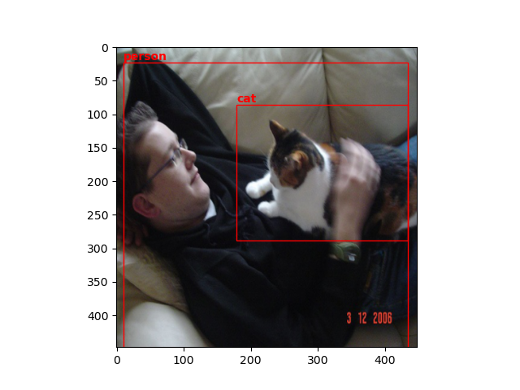
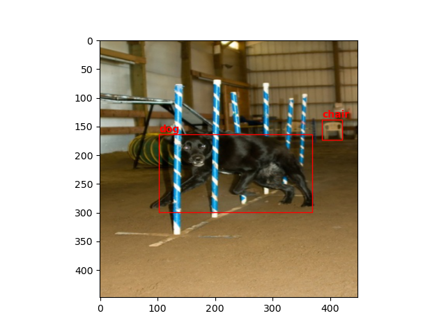
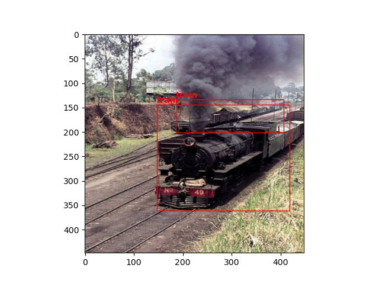
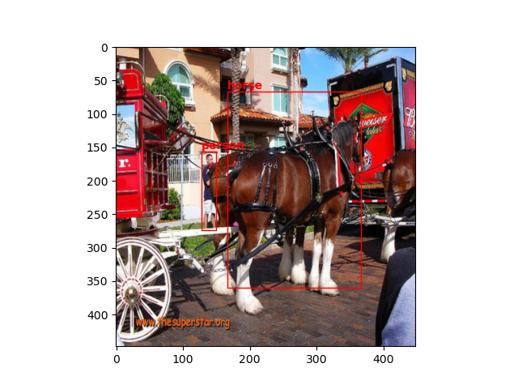

# An Implementation of Yolo v1

This repo aims to provide a Pytorch implementation for well known Yolo algorithm.
I found this very useful to beginners who has good understanding of convolutional networks and wants to reach intermediate Pytorch knowledge.
I trained the model with a small batch of <a href="https://www.kaggle.com/datasets/734b7bcb7ef13a045cbdd007a3c19874c2586ed0b02b4afc86126e89d00af8d2">Pascal VOC Dataset<a> 
and succeed to overfit. After that point I don't think its necessary to train whole dataset since it takes long time with my current setup. In the end it is a matter of how you handle with overfit.
Here is a couple links you may like:
- <a href="https://www.youtube.com/watch?v=n9_XyCGr-MI&list=PLhhyoLH6Ijfw0TpCTVTNk42NN08H6UvNq&index=15">YOLOv1 from Scratch by Alaaddin Persson<a>
- <a href="https://arxiv.org/abs/1506.02640">Original Yolo Paper<a>

### What you will encounter in this repo:
   - Building custom conv network, using batch norm, dropout
   - Creating your own data loader class 
   - Building custom loss function according to the paper
   - Non-max supression and mean average precision
   - Plotting inference results
   
   ### Results
   To plot results, 
   - first save a model you like and change <code>LOAD_MODEL_FILE</code> according to your saved model file name.
   - then run train.py with <code>-p</code>

  
   

     

  
   

   
  ### To Do
   - Unit test for every utils.py function.
   - Inference with pre-downloaded weights.
   - More decent plotting.
   
